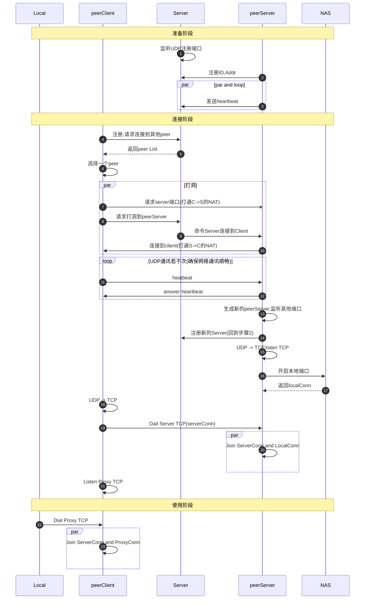

## udp打洞玩具

1. UDP 打洞
2. 将打好的洞转为 TCP，并且新增一个新的 UDP 打洞端口作为原先端口的替代
3. 提供本地端口代理


## usage

```
python3 -m http.server 7777

cd demo/server && go run *.go -serverPort=7788

cd demo/peer && go run *.go -id=HTTP_SERVER -passive=true -serverIP=127.0.0.1 -serverPort=7788 -proxyPort=7777 

cd demo/peer && go run *.go -choose=HTTP_SERVER -passive=false -serverIP=127.0.0.1 -serverPort=7788 -proxyPort=6666 

curl http://127.0.0.1:6666
```


## sequenceDiagram



